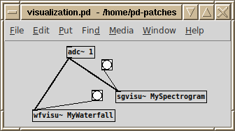
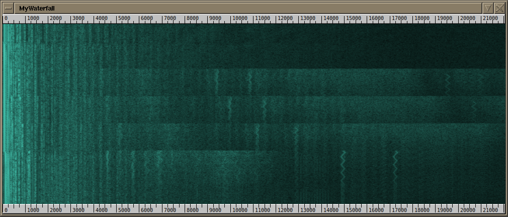
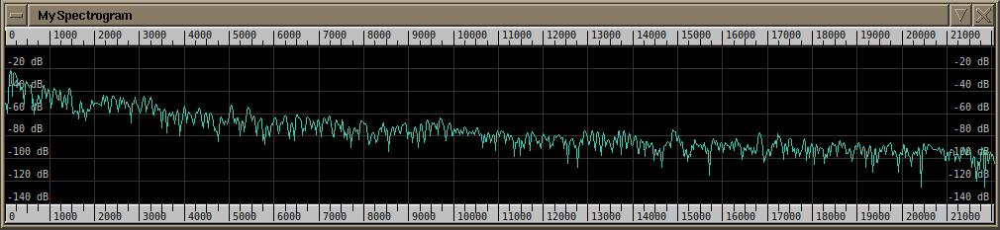
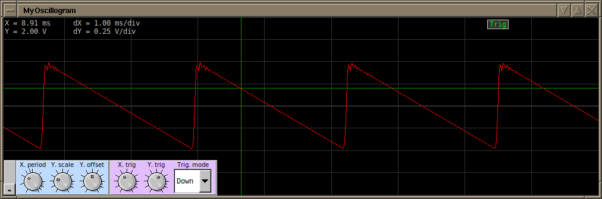

# pd-visualization

This pd-visualization package provides Pure Data externals for visualizing signals.

These visualizers run in external processes and do not disturb real-time signal processing.

A standalone version for the Jack Audio Connection Kit is also part of the package.



The bang message is used to show or hide the visualizer window. By default the visualizer is not started.
When started and in the hidden state, the visualizers do not consume any CPU time.

Platform compatibility:
- Linux
- Windows
- probably Darwin, testing is needed

To build the project, follow the usual CMake command line steps. The built puredata externals are located in the project directory, and the standalone versions are installed on the system. To use this in Pure Data, add the directory of this project to the search paths in preferences.

```
mkdir build ; cd build
cmake -DCMAKE_BUILD_TYPE=Release -DCMAKE_INSTALL_PREFIX=/usr/local ..
make
sudo make install
```

## wfvisu~

This visualization shows a waterfall view of the DFT of the input.



## sgvisu~

This visualization shows a spectrogram of the DFT of the input.



## ogvisu~

This visualization shows an oscillogram of the input.

Features:
- collapsible UI controls
- control of position and scale
- trigger


